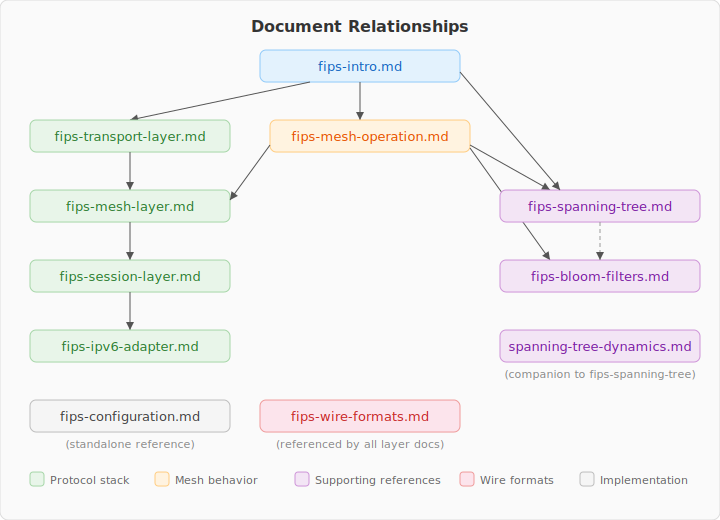

# FIPS Design Documents

Protocol design specifications for the Federated Interoperable Peering
System — a self-organizing encrypted mesh network built on Nostr identities.

## Reading Order

Start with the introduction, then follow the protocol stack from bottom to
top. After the stack, the mesh operation document explains how all the
pieces work together. Supporting references provide deeper dives into
specific topics.

### Protocol Stack

| Document | Description |
| -------- | ----------- |
| [fips-intro.md](fips-intro.md) | Protocol introduction: goals, architecture, layer model |
| [fips-transport-layer.md](fips-transport-layer.md) | Transport layer: datagram delivery over arbitrary media |
| [fips-mesh-layer.md](fips-mesh-layer.md) | FIPS Mesh Protocol (FMP): peer authentication, link encryption, forwarding |
| [fips-session-layer.md](fips-session-layer.md) | FIPS Session Protocol (FSP): end-to-end encryption, sessions |
| [fips-ipv6-adapter.md](fips-ipv6-adapter.md) | IPv6 adaptation: TUN interface, DNS, MTU enforcement |

### Mesh Behavior

| Document | Description |
| -------- | ----------- |
| [fips-mesh-operation.md](fips-mesh-operation.md) | How the mesh operates: routing, discovery, error recovery |
| [fips-wire-formats.md](fips-wire-formats.md) | Wire format reference for all message types |

### Supporting References

| Document | Description |
| -------- | ----------- |
| [fips-spanning-tree.md](fips-spanning-tree.md) | Spanning tree algorithms: root discovery, parent selection, coordinates |
| [fips-bloom-filters.md](fips-bloom-filters.md) | Bloom filter math: FPR analysis, size classes, split-horizon |

### Implementation

| Document | Description |
| -------- | ----------- |
| [fips-configuration.md](fips-configuration.md) | YAML configuration reference |

### Supplemental

| Document | Description |
| -------- | ----------- |
| [spanning-tree-dynamics.md](spanning-tree-dynamics.md) | Spanning tree walkthroughs: convergence scenarios, worked examples |

## Document Relationships

