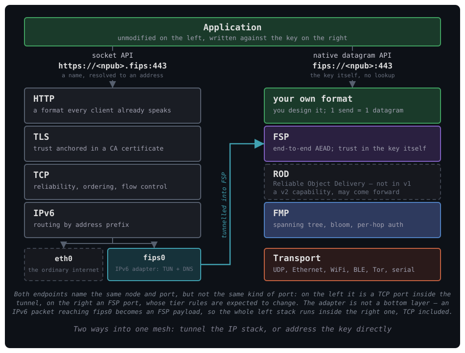

# Native Datagram API

The native datagram API lets a local program move bytes between two public keys
over FSP, with no IPv6 emulation and no TUN device in the path. A program calls
`connect` for a flow to a public key and a port, or `bind` for a port to receive
flows on, and from then on uses ordinary socket calls.

This document explains what the interface is for and where its edges are. For
the surface itself — every type, method, errno and command — see
[../reference/native-api.md](../reference/native-api.md). For the steps to enable
it and write a program, see
[../how-to/use-the-native-datagram-api.md](../how-to/use-the-native-datagram-api.md).

## Where it sits

The two endpoints at the top are the same node reached two ways. **The
`fips://` form is illustrative**: no code in this repository parses it, nothing
registers the scheme, and the API takes a key and a port as separate arguments
rather than a URL. It is drawn because it is the shape an address takes on that
side, against a `.fips` name the adapter's DNS really does resolve.

Read row by row, the native path replaces three layers and declines to replace a
fourth. FSP takes TLS's place and anchors trust in the key rather than in a
certificate authority. FMP takes IPv6's place and routes by spanning tree and
bloom filter rather than by address prefix, with the address derived from the
key. The transport layer takes the medium's place and can be several media at
once.

**There is nothing where TCP was**, and on the native path that is the single
most consequential row today. No acknowledgement, no retransmission, no ordering
and no flow control: a program that needs any of them builds it into its own
payload.

That row is marked **ROD — Reliable Object Delivery**, which is where the
capability is expected to land. ROD is a v2 capability and is not in v1; it may
be pulled forward. Until it is, treat the row as empty and design around it,
because a program written against a reliability layer that is not there yet
fails in the ways this document's "not a reliability layer" section describes.

**The two paths are not alternatives at the bottom.** They converge. An
unmodified IPv6 program does not stop at a wire: its packets reach `fips0`, and
the adapter hands each one to FSP as a payload. That is the arrow running up the
middle of the diagram, and it is why the left stack is drawn ending at an
interface rather than at Ethernet.

So the whole left column runs *inside* the right one. **TCP included** — which
is the practical answer to the empty row above it. A program that needs a
reliable ordered stream over the mesh already has one: run it over `fips0` and
let TCP do what TCP does, inside FSP's encryption. What the native API offers
instead is the same mesh with four layers of machinery removed, for a program
willing to do without them.

The bottom of the diagram is not always the bottom of the stack either. When
FIPS overlays an existing network its transport is UDP, which still rides IP and
Ethernet beneath; when the mesh *is* the network, a transport sits on a link
directly.

## What it is instead of

The fastest way to place the interface is by contrast with the TUN device, which
is the other way a program gets FIPS traffic.

| | TUN interface | Native datagram API |
| --- | ------------- | ------------------- |
| Addressing | IPv6 address | public key, written as an npub |
| Name resolution | DNS over the mesh | none: the program supplies the key |
| Kernel object | TUN device, routes | a `FipsStream` per peer |
| Encapsulation | IPv6 emulated over FSP | FSP port pair, no IP layer |
| Program sees | an IP network | a `FipsStream` |
| Privilege | `CAP_NET_ADMIN` to create the device | membership of group `fips` |
| Demultiplexing | by address and port | by flow, one stream each |

**The IPv6 emulation is not removed by this interface.** It continues to run
beside it on FSP port 256, which is why that port and the tier around it are
refused to a program. What the native API removes is a program's *dependence* on
it: a program that wants to move bytes between two known public keys no longer
has to acquire an IPv6 address, resolve a name, and hand its payload to a
protocol stack that will encapsulate it again.

Both paths reach the same place. A native datagram and an emulated IPv6 packet
are both FSP payloads with a port pair, carried in the same encrypted session to
the same peer. The difference is entirely on the local side of the daemon.

## Status

**The wire is connected**: a datagram sent on a flow leaves the node over FSP,
and one arriving on a held port reaches its flow.

**The interface around it is experimental.** It is not versioned, it has no
compatibility promise, and three of its five commands exist only to let the
daemon's own checks drive the receive path without a peer. It is Linux, FreeBSD
and macOS only — Windows cannot be supported, as it has no `SCM_RIGHTS` — and it
is off by default.

## What this is not

**Not a stable interface.** It is an experiment on the v1 wire. Names, fields,
reply shapes and the command set may change without a deprecation cycle.

**Not the v2 process API.** The v2 external process API is a separate and later
design, which retires ports entirely in favour of a listener, connection and
stream model. Nothing here governs it and nothing there governs this. The one
thing this interface takes from that work is the FSP port tiers, because port
256 already carries the IPv6 shim on the deployed wire and a new service must not
collide with it.

**Not a reliability layer.** There is no acknowledgement, no retransmission, no
ordering guarantee and no flow control between the two ends. A datagram is
carried or it is dropped. Some drops are counted inside the daemon and none are
reported to a program for real traffic. A program that needs delivery guarantees
builds them itself, on top, in the payload — or runs over `fips0` and lets TCP
provide them.

Reliable Object Delivery (ROD) is the v2 capability intended to fill this gap,
and it may be pulled forward into v1. **Nothing here anticipates it**: no field,
reply shape or command on this surface is reserved for it, and a program written
today should assume it does not exist.

**Not an authorization boundary.** The socket's group ownership is the whole of
the access control. Any process that can open it can send as this node's identity
and can receive mesh traffic on any port it can claim, and there is no per-program
separation beyond the port registry. Because the descriptor carries the flow, a
process handed one over `SCM_RIGHTS` can send as this node on that flow without
ever opening the socket. See
[../reference/security.md](../reference/security.md#native-datagram-api).

**Not multi-tenant.** `max_flows` is node-wide with no per-program share, so one
program can exhaust it, and every other program then sees `EMFILE` on `connect`
and silent drops on its listeners.

**Not a connection in the TCP sense.** A successful `connect` is a local
registration and contacts no peer. There is no handshake, no keepalive and no
notification that a peer went away. A flow ends when its descriptor closes, and
in no other way. In particular **a peer cannot end your flow: it has no close to
send.** That single fact shapes every program written against this interface,
and the consequences are drawn out in
[../how-to/use-the-native-datagram-api.md](../how-to/use-the-native-datagram-api.md#four-things-that-will-bite-you).

## See also

- [fips-session-layer.md](fips-session-layer.md) — FSP, which carries the
  datagrams and owns the port pair
- [fips-ipv6-adapter.md](fips-ipv6-adapter.md) — the other consumer of FSP, and
  what this interface is an alternative to
- [../reference/native-api.md](../reference/native-api.md) — the surface, the
  line protocol and the command reference
