# FIPS Wire Formats

This document is the comprehensive wire format reference for all three
protocol layers. It covers transport framing, link-layer message formats,
and session-layer message formats, with an encapsulation walkthrough showing
how application data is wrapped through each layer.

## Encoding Rules

- All multi-byte integers are **little-endian** (LE)
- NodeAddr is **16 bytes** — truncated SHA-256 hash of public key
- Signatures are **64 bytes** — secp256k1 Schnorr
- Variable-length arrays use a **2-byte u16 LE count prefix** followed by
  that many items
- Public keys are **33 bytes** — compressed secp256k1 (02/03 prefix + 32
  bytes)

## Transport Framing

Datagram-oriented transports (UDP, raw Ethernet, radio) preserve natural
packet boundaries and require no additional framing. Stream-oriented
transports (TCP, WebSocket, Tor) must delineate FIPS packets within the
byte stream; the common prefix `payload_len` field provides this
framing directly.

**Ethernet frame type prefix.** The Ethernet transport prepends a 1-byte
frame type before the FMP payload: `0x00` for data frames and `0x01` for
beacon (discovery) frames. This byte is consumed by the transport layer
and is not visible to FMP. The effective MTU for FMP is the interface
MTU minus one byte (typically 1499).

## Link-Layer Formats

All FMP packets begin with a **4-byte common prefix** that identifies the
protocol version, session lifecycle phase, per-packet flags, and payload
length.

### Common Prefix (4 bytes)

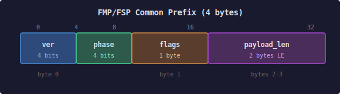

| Field | Size | Description |
| ----- | ---- | ----------- |
| version | 4 bits (high) | Protocol version. Currently 0x0 |
| phase | 4 bits (low) | Session lifecycle phase (see table) |
| flags | 1 byte | Per-packet signal flags (zero during handshake) |
| payload_len | 2 bytes LE | Length of payload after phase-specific header, excluding AEAD tag |

### Phase Table

| Phase | Type | Description |
| ----- | ---- | ----------- |
| 0x0 | Established frame | Post-handshake encrypted traffic |
| 0x1 | Noise IK msg1 | Handshake initiation |
| 0x2 | Noise IK msg2 | Handshake response |

### Flags (Established Phase Only)

| Bit | Name | Description |
| --- | ---- | ----------- |
| 0 | K (key epoch) | Selects active key during rekeying |
| 1 | CE | Congestion Experienced echo |
| 2 | SP (spin bit) | RTT measurement |
| 3-7 | — | Reserved (must be zero) |

Flags must be zero in handshake packets (phase 0x1 and 0x2).

### Established Frame (phase 0x0)

All post-handshake traffic between authenticated peers. Contains one
encrypted link-layer message.

**Outer header** (16 bytes, used as AEAD AAD):

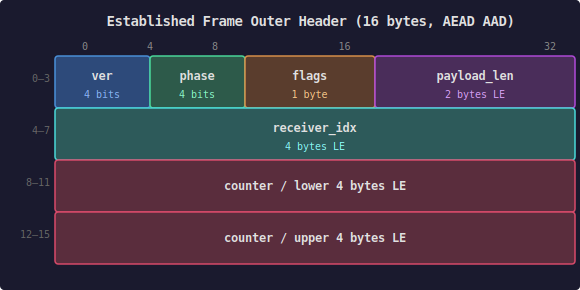

| Field | Size | Description |
| ----- | ---- | ----------- |
| common prefix | 4 bytes | ver=0, phase=0, flags, payload_len |
| receiver_idx | 4 bytes LE | Session index for O(1) lookup |
| counter | 8 bytes LE | Monotonic nonce, used as AEAD nonce and for replay detection |

The entire 16-byte header is authenticated as Associated Data (AAD) in the
ChaCha20-Poly1305 AEAD construction.

**Encrypted inner header** (5 bytes, first bytes of plaintext):

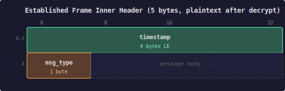

| Field | Size | Description |
| ----- | ---- | ----------- |
| timestamp | 4 bytes LE | Session-relative milliseconds (u32) |
| msg_type | 1 byte | Link-layer message type |

After decryption, the plaintext begins with the 4-byte timestamp followed by
the 1-byte message type and message-specific fields.

**Complete encrypted frame**:

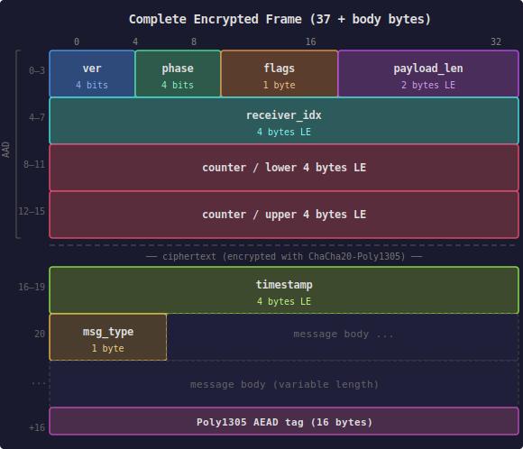

### Message Type Table

| Type | Message | Description |
| ---- | ------- | ----------- |
| 0x00 | SessionDatagram | Encapsulated session-layer payload for forwarding |
| 0x01 | SenderReport | MMP sender-side metrics report (48 bytes) |
| 0x02 | ReceiverReport | MMP receiver-side metrics report (68 bytes) |
| 0x10 | TreeAnnounce | Spanning tree state announcement |
| 0x20 | FilterAnnounce | Bloom filter reachability update |
| 0x30 | LookupRequest | Coordinate discovery request |
| 0x31 | LookupResponse | Coordinate discovery response |
| 0x50 | Disconnect | Orderly link teardown |
| 0x51 | Heartbeat | Link liveness probe |

### Noise IK Message 1 (phase 0x1)

Handshake initiation from connecting party.

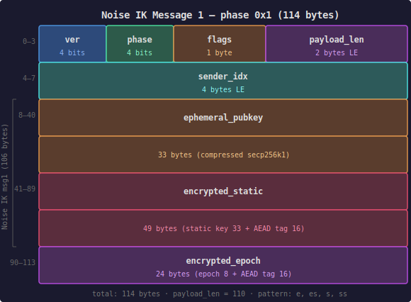

Common prefix: ver=0, phase=0x1, flags=0, payload_len=110 (4 + 106).

| Field | Size | Description |
| ----- | ---- | ----------- |
| common prefix | 4 bytes | ver=0, phase=1, flags=0, payload_len |
| sender_idx | 4 bytes LE | Initiator's session index (becomes receiver's `receiver_idx`) |
| noise_msg1 | 106 bytes | Noise IK first message |

**Noise msg1 breakdown** (106 bytes):

| Offset | Field | Size | Description |
| ------ | ----- | ---- | ----------- |
| 0 | ephemeral_pubkey | 33 bytes | Initiator's ephemeral key (compressed secp256k1) |
| 33 | encrypted_static | 49 bytes | Initiator's static key (33) + AEAD tag (16) |
| 82 | encrypted_epoch | 24 bytes | Startup epoch (8) + AEAD tag (16) |

Noise pattern: `-> e, es, s, ss` with epoch payload

### Noise IK Message 2 (phase 0x2)

Handshake response from responder.

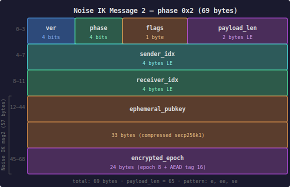

Common prefix: ver=0, phase=0x2, flags=0, payload_len=65 (4 + 4 + 57).

| Field | Size | Description |
| ----- | ---- | ----------- |
| common prefix | 4 bytes | ver=0, phase=2, flags=0, payload_len |
| sender_idx | 4 bytes LE | Responder's session index |
| receiver_idx | 4 bytes LE | Echo of initiator's sender_idx from msg1 |
| noise_msg2 | 57 bytes | Noise IK second message |

**Noise msg2 breakdown** (57 bytes):

| Offset | Field | Size | Description |
| ------ | ----- | ---- | ----------- |
| 0 | ephemeral_pubkey | 33 bytes | Responder's ephemeral key (compressed secp256k1) |
| 33 | encrypted_epoch | 24 bytes | Startup epoch (8) + AEAD tag (16) |

Noise pattern: `<- e, ee, se` with epoch payload

After msg2, both parties derive identical symmetric session keys. The
encrypted epoch in msg1 and msg2 enables peer restart detection — if a
peer's epoch changes, the other side knows it restarted and must
re-establish the link.

### Index Semantics

Each party in a link session maintains two indices:

| Index | Chosen By | Used By | Purpose |
| ----- | --------- | ------- | ------- |
| our_index | Us | Them | They include this as `receiver_idx` in packets to us |
| their_index | Them | Us | We include this as `receiver_idx` in packets to them |

### Handshake Flow

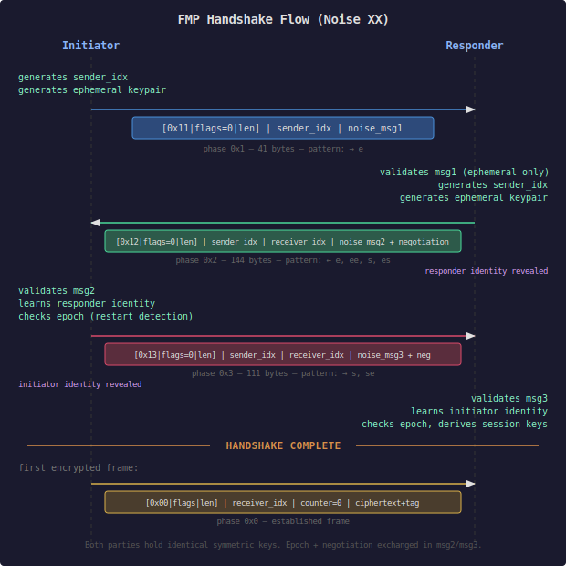

## Link-Layer Message Types

These messages are carried as plaintext inside encrypted frames (phase 0x0).
After decryption of the AEAD ciphertext, the plaintext begins with a 4-byte
session-relative timestamp followed by the 1-byte message type and
message-specific fields.

### TreeAnnounce (0x10)

Spanning tree state announcement, exchanged between direct peers only.

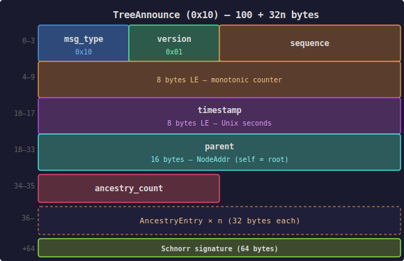

| Offset | Field | Size | Description |
| ------ | ----- | ---- | ----------- |
| 0 | msg_type | 1 byte | 0x10 |
| 1 | version | 1 byte | 0x01 (v1) |
| 2 | sequence | 8 bytes LE | Monotonic counter, increments on parent change |
| 10 | timestamp | 8 bytes LE | Unix seconds |
| 18 | parent | 16 bytes | NodeAddr of selected parent (self = root) |
| 34 | ancestry_count | 2 bytes LE | Number of AncestryEntry records |
| 36 | ancestry | 32 x n bytes | AncestryEntry array (self -> root) |
| 36 + 32n | signature | 64 bytes | Schnorr signature over entire message |

**AncestryEntry** (32 bytes):


| Offset | Field | Size | Description |
| ------ | ----- | ---- | ----------- |
| 0 | node_addr | 16 bytes | Node's routing identifier |
| 16 | sequence | 8 bytes LE | Node's sequence number |
| 24 | timestamp | 8 bytes LE | Node's Unix timestamp |

**Size**: `100 + (n x 32)` bytes, where n = `ancestry_count` (depth + 1,
includes self)

| Tree Depth | Payload | With Link Overhead |
| ---------- | ------- | ------------------ |
| 0 (root) | 132 bytes | 169 bytes |
| 3 | 228 bytes | 265 bytes |
| 5 | 292 bytes | 329 bytes |
| 10 | 452 bytes | 489 bytes |

### FilterAnnounce (0x20)

Bloom filter reachability update, exchanged between direct peers only.

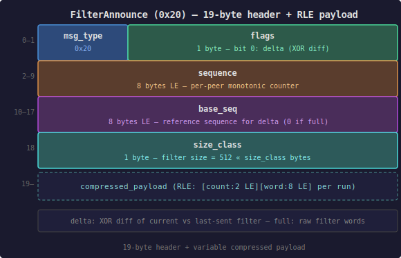

| Offset | Field | Size | Description |
| ------ | ----- | ---- | ----------- |
| 0 | msg_type | 1 byte | 0x20 |
| 1 | sequence | 8 bytes LE | Monotonic counter for freshness |
| 9 | hash_count | 1 byte | Number of hash functions (5 in v1) |
| 10 | size_class | 1 byte | Filter size: `512 << size_class` bytes |
| 11 | filter_bits | variable | Bloom filter bit array |

**Size class table**:

| size_class | Bytes | Bits | Status |
| ---------- | ----- | ---- | ------ |
| 0 | 512 | 4,096 | Reserved |
| 1 | 1,024 | 8,192 | **v1 (MUST use)** |
| 2 | 2,048 | 16,384 | Reserved |
| 3 | 4,096 | 32,768 | Reserved |

**v1 payload**: 1,035 bytes (11 header + 1,024 filter).
With link overhead: 1,072 bytes.

### LookupRequest (0x30)

Coordinate discovery request, flooded through the mesh.

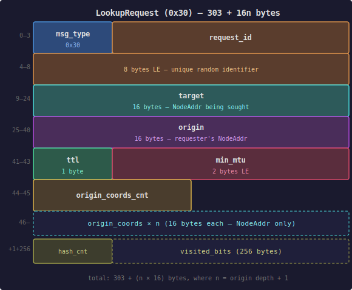

| Offset | Field | Size | Description |
| ------ | ----- | ---- | ----------- |
| 0 | msg_type | 1 byte | 0x30 |
| 1 | request_id | 8 bytes LE | Unique random identifier |
| 9 | target | 16 bytes | NodeAddr being sought |
| 25 | origin | 16 bytes | Requester's NodeAddr |
| 41 | ttl | 1 byte | Remaining hops (default 64) |
| 42 | min_mtu | 2 bytes LE | Minimum transport MTU the origin requires (0 = no requirement) |
| 44 | origin_coords_cnt | 2 bytes LE | Number of coordinate entries |
| 46 | origin_coords | 16 x n bytes | Requester's ancestry (NodeAddr only) |
| 46 + 16n | visited_hash_cnt | 1 byte | Hash count for visited filter |
| 47 + 16n | visited_bits | 256 bytes | Compact bloom of visited nodes |

**Size**: `303 + (n x 16)` bytes, where n = origin depth + 1

| Origin Depth | Payload |
| ------------ | ------- |
| 3 | 351 bytes |
| 5 | 383 bytes |
| 10 | 463 bytes |

### LookupResponse (0x31)

Coordinate discovery response, greedy-routed back to requester.

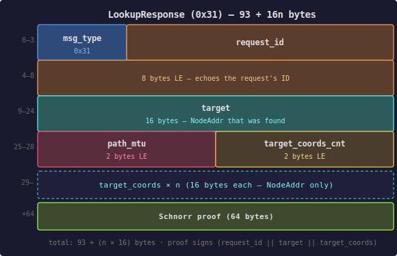

| Offset | Field | Size | Description |
| ------ | ----- | ---- | ----------- |
| 0 | msg_type | 1 byte | 0x31 |
| 1 | request_id | 8 bytes LE | Echoes the request's ID |
| 9 | target | 16 bytes | NodeAddr that was found |
| 25 | path_mtu | 2 bytes LE | Minimum MTU along response path (transit-annotated) |
| 27 | target_coords_cnt | 2 bytes LE | Number of coordinate entries |
| 29 | target_coords | 16 x n bytes | Target's ancestry (NodeAddr only) |
| 29 + 16n | proof | 64 bytes | Schnorr signature over `(request_id \|\| target \|\| target_coords)` |

**Size**: `93 + (n x 16)` bytes

| Target Depth | Payload |
| ------------ | ------- |
| 3 | 141 bytes |
| 5 | 173 bytes |
| 10 | 253 bytes |

The `path_mtu` field is initialized to `u16::MAX` by the target and each
transit hop applies `min(path_mtu, outgoing_link_mtu)`, giving the
originator an MTU estimate for the discovered path.

**Proof coverage**: Signs `(request_id || target || target_coords)` —
`path_mtu` is excluded from the proof because it is a transit annotation
modified at each hop. Coordinates are included because proof verification
at the source confirms the target actually holds the claimed tree position.
The source verifies the proof upon receipt.

### SessionDatagram (0x00)

Encapsulated session-layer payload for multi-hop forwarding.

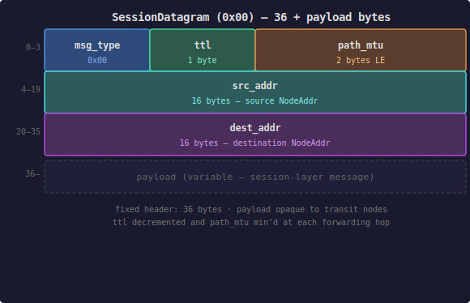

| Offset | Field | Size | Description |
| ------ | ----- | ---- | ----------- |
| 0 | msg_type | 1 byte | 0x00 |
| 1 | ttl | 1 byte | Remaining hops, decremented each hop |
| 2 | path_mtu | 2 bytes LE | Path MTU, min'd at each forwarding hop |
| 4 | src_addr | 16 bytes | Source NodeAddr |
| 20 | dest_addr | 16 bytes | Destination NodeAddr |
| 36 | payload | variable | Session-layer message |

**Fixed header**: 36 bytes (`SESSION_DATAGRAM_HEADER_SIZE`)

The `path_mtu` field is initialized to `u16::MAX` by the sender and each
forwarding hop applies `min(path_mtu, outgoing_link_mtu)`, giving the
receiver an estimate of the minimum MTU along the path.

The payload is opaque to transit nodes — session-layer encrypted
independently of link encryption.

### Disconnect (0x50)

Orderly link teardown with reason code.


| Offset | Field | Size | Description |
| ------ | ----- | ---- | ----------- |
| 0 | msg_type | 1 byte | 0x50 |
| 1 | reason | 1 byte | Disconnect reason code |

**Reason codes**:

| Code | Name | Description |
| ---- | ---- | ----------- |
| 0x00 | Shutdown | Normal operator-requested stop |
| 0x01 | Restart | Restarting, may reconnect soon |
| 0x02 | ProtocolError | Protocol error encountered |
| 0x03 | TransportFailure | Transport failure |
| 0x04 | ResourceExhaustion | Memory or connection limit |
| 0x05 | SecurityViolation | Authentication or policy violation |
| 0x06 | ConfigurationChange | Peer removed from configuration |
| 0x07 | Timeout | Heartbeat liveness timeout |
| 0xFF | Other | Unspecified reason |

### SenderReport (0x01)

Sent by the frame sender to provide interval-based transmission statistics.

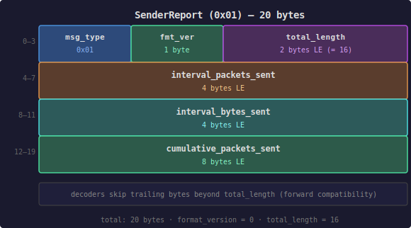

| Offset | Field | Size | Encoding |
| ------ | ----- | ---- | -------- |
| 0 | msg_type | 1 | `0x01` |
| 1 | reserved | 3 | Zero |
| 4 | interval_start_counter | 8 | u64 LE — first counter in this interval |
| 12 | interval_end_counter | 8 | u64 LE — last counter in this interval |
| 20 | interval_start_timestamp | 4 | u32 LE — timestamp at interval start |
| 24 | interval_end_timestamp | 4 | u32 LE — timestamp at interval end |
| 28 | interval_bytes_sent | 4 | u32 LE — payload bytes sent in interval |
| 32 | cumulative_packets_sent | 8 | u64 LE — total packets sent on this link |
| 40 | cumulative_bytes_sent | 8 | u64 LE — total bytes sent on this link |

**Total: 48 bytes.**

### ReceiverReport (0x02)

Sent by the frame receiver to provide loss, jitter, and timing feedback.

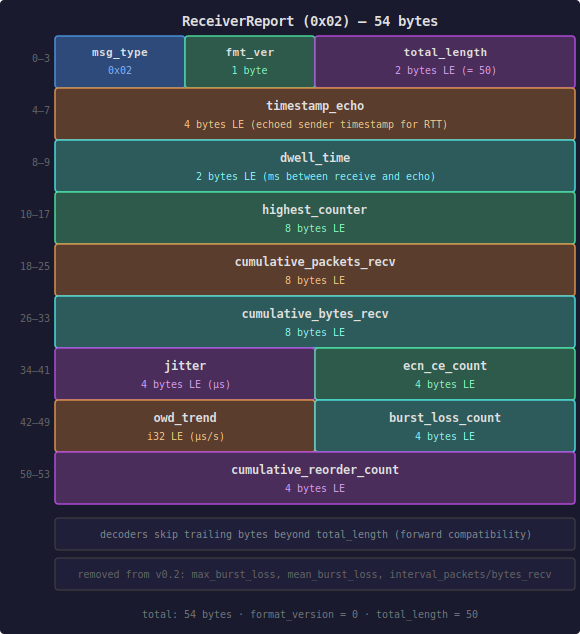

| Offset | Field | Size | Encoding |
| ------ | ----- | ---- | -------- |
| 0 | msg_type | 1 | `0x02` |
| 1 | reserved | 3 | Zero |
| 4 | highest_counter | 8 | u64 LE — highest counter value received |
| 12 | cumulative_packets_recv | 8 | u64 LE — total packets received |
| 20 | cumulative_bytes_recv | 8 | u64 LE — total bytes received |
| 28 | timestamp_echo | 4 | u32 LE — echoed sender timestamp for RTT |
| 32 | dwell_time | 2 | u16 LE — time between receive and echo (ms) |
| 34 | max_burst_loss | 2 | u16 LE — largest loss burst in interval |
| 36 | mean_burst_loss | 2 | u16 LE — mean burst length (u8.8 fixed-point) |
| 38 | reserved | 2 | Zero |
| 40 | jitter | 4 | u32 LE — interarrival jitter (microseconds) |
| 44 | ecn_ce_count | 4 | u32 LE — cumulative ECN-CE marked packets |
| 48 | owd_trend | 4 | i32 LE — one-way delay trend (µs/s, signed) |
| 52 | burst_loss_count | 4 | u32 LE — number of loss bursts in interval |
| 56 | cumulative_reorder_count | 4 | u32 LE — total reordered packets |
| 60 | interval_packets_recv | 4 | u32 LE — packets received in interval |
| 64 | interval_bytes_recv | 4 | u32 LE — bytes received in interval |

**Total: 68 bytes.**

## Session-Layer Message Formats

Session-layer messages are carried as the payload of a SessionDatagram (0x00).
All FSP messages begin with a **4-byte common prefix** that identifies the
protocol version, session lifecycle phase, per-packet flags, and payload length.

### FSP Common Prefix (4 bytes)

| Field | Size | Description |
| ----- | ---- | ----------- |
| version | 4 bits (high) | Protocol version. Currently 0x0 |
| phase | 4 bits (low) | Session lifecycle phase (see table) |
| flags | 1 byte | Per-packet signal flags (zero during handshake) |
| payload_len | 2 bytes LE | Length of payload after phase-specific header |

### FSP Phase Table

| Phase | Type | Description |
| ----- | ---- | ----------- |
| 0x0 | Established | Post-handshake encrypted traffic or plaintext error signals |
| 0x1 | Handshake msg1 | SessionSetup (Noise XK msg1) |
| 0x2 | Handshake msg2 | SessionAck (Noise XK msg2) |
| 0x3 | Handshake msg3 | SessionMsg3 (Noise XK msg3) |

### FSP Flags (Established Phase Only)

| Bit | Name | Description |
| --- | ---- | ----------- |
| 0 | CP (coords present) | Source and destination coordinates follow the header in cleartext |
| 1 | K (key epoch) | Selects active key during rekeying |
| 2 | U (unencrypted) | Payload is plaintext (error signals) |
| 3-7 | — | Reserved (must be zero) |

Flags must be zero in handshake packets (phase 0x1, 0x2, and 0x3).

### FSP Encrypted Message (phase 0x0, U flag clear)

Post-handshake encrypted data. The 12-byte cleartext header is used as AEAD
AAD. Coordinates may appear in cleartext between the header and ciphertext
when the CP flag is set.

**Cleartext header** (12 bytes, used as AEAD AAD):

| Field | Size | Description |
| ----- | ---- | ----------- |
| common prefix | 4 bytes | ver=0, phase=0, flags, payload_len |
| counter | 8 bytes LE | Monotonic nonce, used as AEAD nonce and for replay detection |

**Optional cleartext coordinates** (when CP flag is set):

| Field | Size | Description |
| ----- | ---- | ----------- |
| src_coords_count | 2 bytes LE | Number of source coordinate entries |
| src_coords | 16 x n bytes | Source's ancestry (NodeAddr, self -> root) |
| dest_coords_count | 2 bytes LE | Number of dest coordinate entries |
| dest_coords | 16 x m bytes | Destination's ancestry |

Transit nodes parse the CP flag and extract coordinates without decryption.

**Encrypted inner header** (6 bytes, first bytes of AEAD plaintext):

| Field | Size | Description |
| ----- | ---- | ----------- |
| timestamp | 4 bytes LE | Session-relative milliseconds (u32) |
| msg_type | 1 byte | Session-layer message type |
| inner_flags | 1 byte | Bit 0: SP (spin bit for RTT measurement) |

After the inner header, the remaining plaintext is the message-type-specific
body.

**Complete encrypted message**:

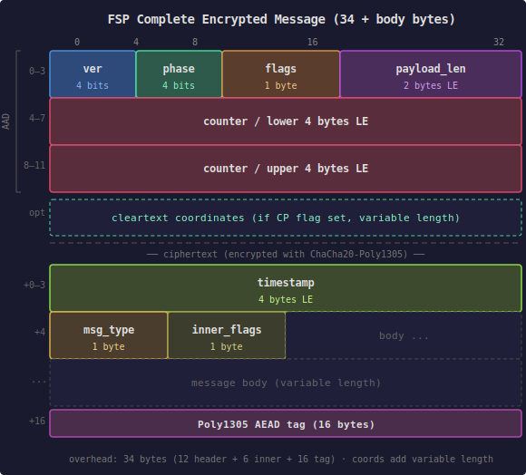

### FSP Session Message Types

| Type | Message | Description |
| ---- | ------- | ----------- |
| 0x10 | Data | Application data (IPv6 payload via TUN) |
| 0x11 | SenderReport | MMP sender-side metrics report |
| 0x12 | ReceiverReport | MMP receiver-side metrics report |
| 0x13 | PathMtuNotification | End-to-end path MTU echo |
| 0x14 | CoordsWarmup | Standalone coordinate cache warming |
| 0x20 | CoordsRequired | Error: transit node lacks destination coordinates |
| 0x21 | PathBroken | Error: greedy routing reached dead end |
| 0x22 | MtuExceeded | Error: forwarded packet exceeds next-hop MTU |

Message types 0x10-0x14 are carried inside the AEAD ciphertext (dispatched
by the `msg_type` field in the encrypted inner header). Types 0x20-0x22 are
plaintext error signals (U flag set, no encryption).

Session-layer SenderReport (0x11) and ReceiverReport (0x12) use the same
body format as their link-layer counterparts (0x01 and 0x02). The msg_type
byte in the body matches the link-layer value; dispatch to the correct layer
happens at the session level based on the FSP message type.

### SessionSetup (phase 0x1)

Establishes a session and warms transit coordinate caches. Contains the
first message of the Noise XK handshake (ephemeral key only — the
initiator's static identity is not revealed until msg3).

SessionSetup, SessionAck, and SessionMsg3 are identified by the **phase**
field in the FSP common prefix (0x1, 0x2, 0x3), not by a message type
byte. The `msg_type` field in the encrypted inner header applies only to
established-phase (0x0) messages.

Encoded with FSP prefix: ver=0, phase=0x1, flags=0, payload_len.

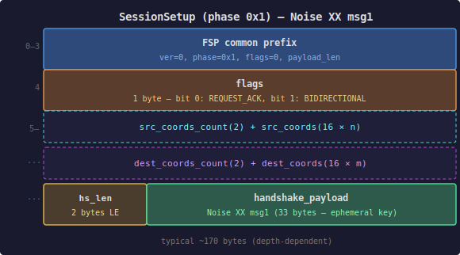

**Body** (after 4-byte FSP prefix):

| Offset | Field | Size | Description |
| ------ | ----- | ---- | ----------- |
| 0 | flags | 1 byte | Bit 0: REQUEST_ACK, Bit 1: BIDIRECTIONAL |
| 1 | src_coords_count | 2 bytes LE | Number of source coordinate entries |
| 3 | src_coords | 16 x n bytes | Source's ancestry (NodeAddr, self -> root) |
| ... | dest_coords_count | 2 bytes LE | Number of dest coordinate entries |
| ... | dest_coords | 16 x m bytes | Destination's ancestry |
| ... | handshake_len | 2 bytes LE | Noise payload length |
| ... | handshake_payload | variable | Noise XK msg1 (33 bytes — ephemeral key only) |

### SessionAck (phase 0x2)

Second message of the Noise XK handshake. The responder sends its
ephemeral key and encrypted epoch.
Encoded with FSP prefix: ver=0, phase=0x2, flags=0, payload_len.

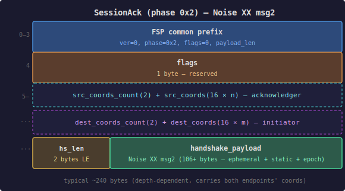

**Body** (after 4-byte FSP prefix):

| Offset | Field | Size | Description |
| ------ | ----- | ---- | ----------- |
| 0 | flags | 1 byte | Reserved |
| 1 | src_coords_count | 2 bytes LE | Number of acknowledger coordinate entries |
| 3 | src_coords | 16 x n bytes | Acknowledger's ancestry (for cache warming) |
| ... | dest_coords_count | 2 bytes LE | Number of initiator coordinate entries |
| ... | dest_coords | 16 x m bytes | Initiator's ancestry (for return-path cache warming) |
| ... | handshake_len | 2 bytes LE | Noise payload length |
| ... | handshake_payload | variable | Noise XK msg2 (57 bytes — ephemeral key + encrypted epoch) |

### SessionMsg3 (phase 0x3)

Third and final message of the Noise XK handshake. The initiator reveals
its encrypted static identity and epoch. After msg3, both parties derive
identical symmetric session keys and the session is established.
Encoded with FSP prefix: ver=0, phase=0x3, flags=0, payload_len.

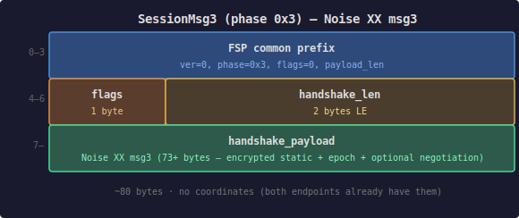

**Body** (after 4-byte FSP prefix):

| Offset | Field | Size | Description |
| ------ | ----- | ---- | ----------- |
| 0 | flags | 1 byte | Reserved |
| 1 | handshake_len | 2 bytes LE | Noise payload length |
| 3 | handshake_payload | variable | Noise XK msg3 (73 bytes — encrypted static + encrypted epoch) |

**Noise XK msg3 breakdown** (73 bytes):

| Offset | Field | Size | Description |
| ------ | ----- | ---- | ----------- |
| 0 | encrypted_static | 49 bytes | Initiator's static key (33) + AEAD tag (16) |
| 49 | encrypted_epoch | 24 bytes | Startup epoch (8) + AEAD tag (16) |

SessionMsg3 does not carry coordinates — both endpoints already have each
other's coordinates from SessionSetup (msg1) and SessionAck (msg2).

### Data (0x10)

Application data (typically IPv6 payload). This is the `msg_type` byte
inside the encrypted inner header — there is no separate DataPacket struct.
The body after the inner header is delivered directly to the TUN interface.

### PathMtuNotification (0x13)

Sent by the destination to report the observed forward-path MTU.

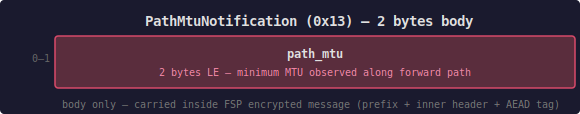

| Offset | Field | Size | Encoding |
| ------ | ----- | ---- | -------- |
| 0 | path_mtu | 2 | u16 LE — minimum MTU observed along the forward path |

**Total body: 2 bytes** (plus FSP common prefix + encrypted header + AEAD tag).

### CoordsWarmup (0x14)

Standalone coordinate cache warming message. Sent when piggybacking coordinates
via the CP flag on a data packet would exceed the transport MTU, or as an
immediate response to CoordsRequired/PathBroken signals (rate-limited).

CoordsWarmup is an encrypted FSP message with the CP flag set and an empty
body. Transit nodes extract coordinates via the existing CP-flag parsing
path — no transit-side changes required.

**Wire format**:

```text
FSP header (12 bytes, AAD): ver=0, phase=0, flags=CP, counter, payload_len
Cleartext coords: src_coords + dst_coords (same encoding as CP flag)
AEAD ciphertext: inner_header(6) + Poly1305 tag(16) = 22 bytes

Total FSP payload: 12 + coords + 22
```

The cleartext coords section uses the same variable-length encoding as any
CP-flagged message: `src_coords_count(2) + src_coords(16×n) +
dest_coords_count(2) + dest_coords(16×m)`.

**Typical size** (depth-3 tree): 12 + (2+64+2+64) + 22 = **166 bytes** FSP
payload. With SessionDatagram + link overhead: 166 + 36 + 37 = **239 bytes**
on the wire.

### CoordsRequired (0x20)

Plaintext error signal — transit node lacks coordinates for destination.
Identified by the FSP phase field, not a separate message type byte
(same as SessionSetup/SessionAck/SessionMsg3).
Encoded with FSP prefix: ver=0, phase=0x0, U flag set, payload_len=34.

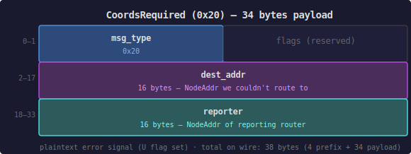

**Payload** (after 4-byte FSP prefix):

| Offset | Field | Size | Description |
| ------ | ----- | ---- | ----------- |
| 0 | msg_type | 1 byte | 0x20 |
| 1 | flags | 1 byte | Reserved |
| 2 | dest_addr | 16 bytes | NodeAddr we couldn't route to |
| 18 | reporter | 16 bytes | NodeAddr of reporting router |

**Payload size**: 34 bytes. **Total on wire**: 38 bytes (4 prefix + 34 payload).

### PathBroken (0x21)

Plaintext error signal — greedy routing reached a dead end.
Encoded with FSP prefix: ver=0, phase=0x0, U flag set, payload_len.

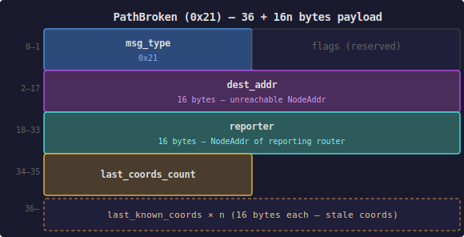

**Payload** (after 4-byte FSP prefix):

| Offset | Field | Size | Description |
| ------ | ----- | ---- | ----------- |
| 0 | msg_type | 1 byte | 0x21 |
| 1 | flags | 1 byte | Reserved |
| 2 | dest_addr | 16 bytes | Unreachable NodeAddr |
| 18 | reporter | 16 bytes | NodeAddr of reporting router |
| 34 | last_coords_count | 2 bytes LE | Number of stale coordinate entries |
| 36 | last_known_coords | 16 x n bytes | Stale coordinates that failed |

### MtuExceeded (0x22)

Plaintext error signal — forwarded packet exceeds the next-hop link MTU.
Sent by a transit router back to the source when a SessionDatagram cannot
be forwarded because its size exceeds the outgoing link's MTU.
Encoded with FSP prefix: ver=0, phase=0x0, U flag set, payload_len=36.

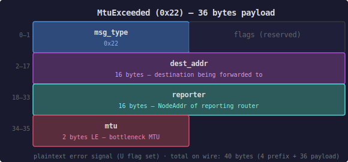

**Payload** (after 4-byte FSP prefix):

| Offset | Field | Size | Description |
| ------ | ----- | ---- | ----------- |
| 0 | msg_type | 1 byte | 0x22 |
| 1 | flags | 1 byte | Reserved |
| 2 | dest_addr | 16 bytes | NodeAddr of the destination being forwarded to |
| 18 | reporter | 16 bytes | NodeAddr of the router that detected the MTU violation |
| 34 | mtu | 2 bytes LE | Bottleneck MTU at the reporting router |

**Payload size**: 36 bytes. **Total on wire**: 40 bytes (4 prefix + 36 payload).

The source uses the reported MTU to adjust its session-layer path MTU
estimate. MtuExceeded is the reactive complement to the proactive
`path_mtu` field in SessionDatagram and LookupResponse.

## Encapsulation Walkthrough

A complete picture of how application data is wrapped through each layer.

### Application Data -> Wire

Starting with an application sending a 1024-byte payload to a destination:

```text
Layer 4: Application data
    1024 bytes

Layer 3: Session encryption (FSP)
    FSP header (12 bytes) + AEAD(inner_hdr (6) + payload (1024)) + AEAD tag (16)
    = 1058 bytes

Layer 2: SessionDatagram envelope (FMP routing)
    msg_type (1) + ttl (1) + path_mtu (2) + src_addr (16) + dest_addr (16) + payload (1058)
    = 1094 bytes

Layer 1: Link encryption (FMP per-hop)
    outer header (16) + encrypted(inner_hdr (5) + datagram (1094)) + AEAD tag (16)
    = 1131 bytes

Layer 0: Transport
    UDP datagram containing 1131 bytes
```

### Overhead Budget

| Layer | Overhead | Component |
| ----- | -------- | --------- |
| Link encryption | 37 bytes | 16 outer header (AAD) + 5 inner header (timestamp + msg_type) + 16 AEAD tag |
| SessionDatagram body | 35 bytes | 1 ttl + 2 path_mtu + 16 src + 16 dest (msg_type counted in inner header) |
| FSP header | 12 bytes | 4 prefix + 8 counter |
| FSP inner header | 6 bytes | 4 timestamp + 1 msg_type + 1 inner_flags (inside AEAD) |
| Session AEAD tag | 16 bytes | Poly1305 tag on session-encrypted payload |
| **Data path total** | **106 bytes** | `FIPS_OVERHEAD` constant |

### At Each Transit Node

```text
1. Receive UDP datagram
2. Parse common prefix -> version, phase, flags, payload_len
3. Phase 0x0 -> established frame
4. Look up (transport_id, receiver_idx) -> session
5. Check replay window (counter)
6. Decrypt with link keys (16-byte header as AAD) -> plaintext
7. Strip inner header -> timestamp, msg_type
8. msg_type 0x00 -> SessionDatagram
9. Read dest_addr -> routing decision
10. Decrement ttl, min path_mtu
11. Re-encrypt with next-hop link keys
12. Send via next-hop transport
```

Transit nodes see the SessionDatagram envelope (src_addr, dest_addr,
ttl, path_mtu) but cannot read the session-layer payload (encrypted with
endpoint session keys).

## Size Summary

### FMP Handshake Messages (Noise IK)

| Message | Raw Noise | Wire Frame |
| ------- | --------- | ---------- |
| IK msg1 (ephemeral + encrypted static + encrypted epoch) | 106 bytes | 114 bytes |
| IK msg2 (ephemeral + encrypted epoch) | 57 bytes | 69 bytes |

### FSP Handshake Messages (Noise XK)

| Message | Raw Noise | Notes |
| ------- | --------- | ----- |
| XK msg1 (ephemeral only) | 33 bytes | Carried in SessionSetup |
| XK msg2 (ephemeral + encrypted epoch) | 57 bytes | Carried in SessionAck |
| XK msg3 (encrypted static + encrypted epoch) | 73 bytes | Carried in SessionMsg3 |

### Link-Layer Messages (inside encrypted frame)

| Message | Size | Notes |
| ------- | ---- | ----- |
| TreeAnnounce | 100 + 32n bytes | n = depth + 1 |
| FilterAnnounce | 1,035 bytes | v1 (1KB filter) |
| LookupRequest | 303 + 16n bytes | n = origin depth + 1 |
| LookupResponse | 93 + 16n bytes | n = target depth + 1 |
| SessionDatagram | 36 + payload bytes | Fixed 36-byte header |
| Disconnect | 2 bytes | |

### Session-Layer Messages (inside SessionDatagram)

| Message | Typical Size | Notes |
| ------- | ------------ | ----- |
| SessionSetup | ~170 bytes | Depth-dependent (XK msg1 = 33 bytes) |
| SessionAck | ~190 bytes | Depth-dependent, carries both endpoints' coords (XK msg2 = 57 bytes) |
| SessionMsg3 | ~80 bytes | Fixed (XK msg3 = 73 bytes, no coords) |
| Data (minimal) | 12 + 6 + payload + 16 bytes | Steady state |
| Data (with coords) | 12 + ~130 + 6 + payload + 16 bytes | Warmup/recovery |
| SenderReport | 12 + 6 + 46 + 16 bytes | MMP metrics |
| ReceiverReport | 12 + 6 + 66 + 16 bytes | MMP metrics |
| PathMtuNotification | 12 + 6 + 2 + 16 bytes | MTU signal |
| CoordsWarmup | 12 + coords + 6 + 16 bytes | Standalone warmup (empty body) |
| CoordsRequired | 38 bytes | Fixed (prefix + msg_type + body) |
| PathBroken | 35 + 16n bytes | Includes stale coords |
| MtuExceeded | 40 bytes | Fixed (prefix + msg_type + body) |

### Complete Packet Sizes (link + session)

| Scenario | Wire Size | Notes |
| -------- | --------- | ----- |
| Encrypted frame minimum | 37 bytes | Empty body |
| SessionDatagram + Data (minimal) | 37 + 35 + 12 + 6 + payload + 16 | 106 + payload |
| SessionDatagram + Data (with coords) | 106 + coords + payload | Coords vary with tree depth |
| SessionDatagram + SessionSetup | ~275 bytes | Depth-3, both dirs |
| SessionDatagram + CoordsRequired | 37 + 36 + 38 = 111 bytes | Including link overhead |

## References

- [fips-mesh-layer.md](fips-mesh-layer.md) — FMP behavioral specification
- [fips-session-layer.md](fips-session-layer.md) — FSP behavioral specification
- [fips-transport-layer.md](fips-transport-layer.md) — Transport framing
- [fips-mesh-operation.md](fips-mesh-operation.md) — How messages work together
- [fips-ipv6-adapter.md](fips-ipv6-adapter.md) — MTU enforcement
