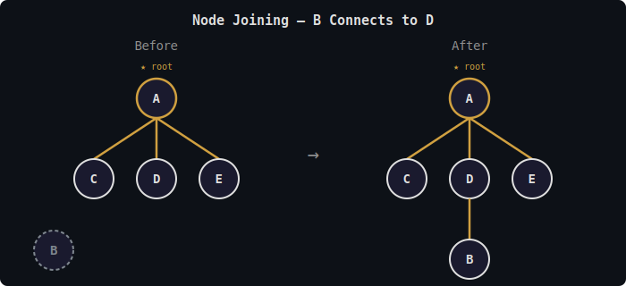
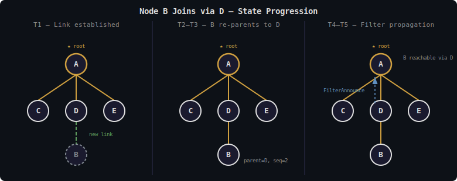
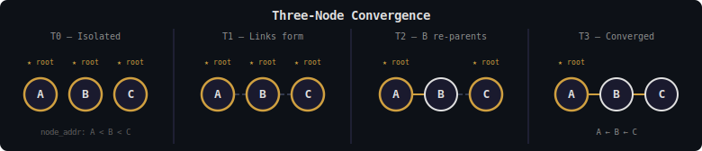
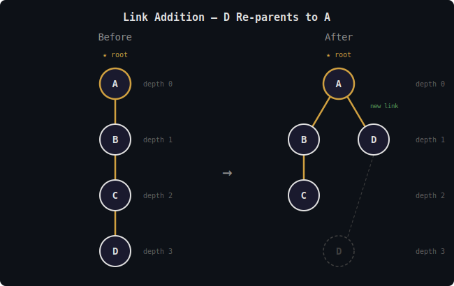
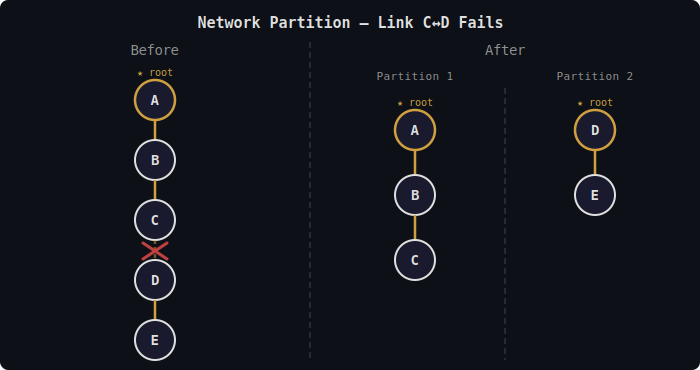
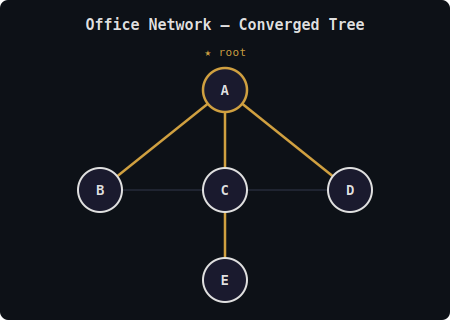
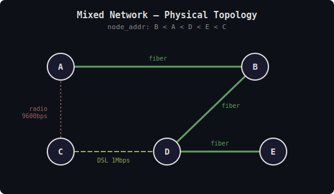
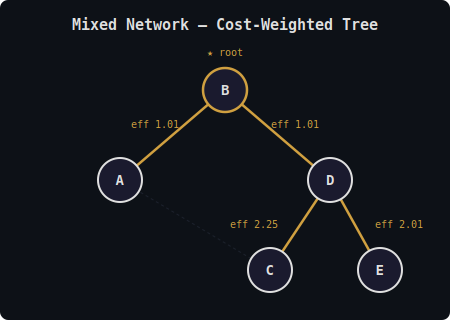
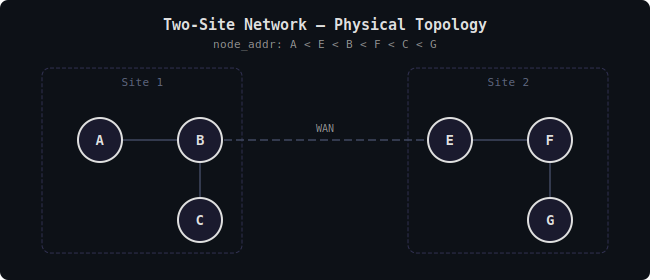
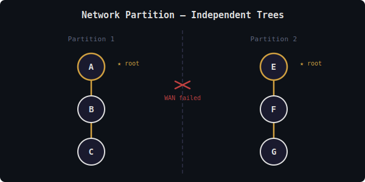

# FIPS Spanning Tree Protocol Dynamics

A detailed study of the gossip-based spanning tree protocol, focusing on
operational behavior under various mesh conditions. This document complements
[fips-intro.md](fips-intro.md) with step-by-step walkthroughs of protocol
dynamics rather than message formats and data structures.

For wire formats, see [fips-wire-formats.md](fips-wire-formats.md) (TreeAnnounce section).
For spanning tree algorithms and data structures, see
[fips-spanning-tree.md](fips-spanning-tree.md). For how the spanning tree fits
into mesh routing, see [fips-mesh-operation.md](fips-mesh-operation.md).

## Contents

1. [Core Concepts](#1-core-concepts)
2. [Single Node Startup](#2-single-node-startup)
3. [Node Joining an Existing Network](#3-node-joining-an-existing-network)
4. [Network Convergence](#4-network-convergence)
5. [Topology Changes and Reconvergence](#5-topology-changes-and-reconvergence)
6. [Partition Detection and Handling](#6-partition-detection-and-handling)
7. [Link Failure Detection](#7-link-failure-detection)
8. [Parent Selection](#8-parent-selection)
9. [Steady State Behavior](#9-steady-state-behavior)
10. [Worked Examples](#10-worked-examples)
11. [Known Limitations](#known-limitations)

---

## 1. Core Concepts

### The CRDT Approach

The spanning tree is maintained as a distributed soft-state CRDT-Set (see
Shapiro et al., "Conflict-free Replicated Data Types"). Each node makes
independent local decisions about parent selection, gossips these decisions
to peers, and the system converges to a consistent structure without
coordination.

Key properties:

- **Consistency**: Two peered nodes eventually have identical views of their
  shared relevant portion of the tree
- **Atomicity**: Updates to a common ancestor are applied atomically across all
  peer records in the local routing table
- **Convergence**: The structure converges in time proportional to tree *depth*,
  not network *size*

### What Each Node Knows (Bounded State)

A node's TreeState contains only:

1. **Its own parent declaration** - who it has selected as parent
2. **Direct peer declarations** - each peer's parent selection
3. **Ancestry of peers** - the chain from each peer up to root

This is **O(P × D)** entries where P is peer count and D is tree depth — not
O(N) where N is network size. This bounded-state approach follows
Yggdrasil/Ironwood's design, where each node knows only its own ancestry and
direct peer information, in contrast to classical STP (IEEE 802.1D) where all
bridges participate in a global election. A node does *not* know about:

- Other subtrees branching off its ancestors
- Siblings of ancestors
- Nodes in distant parts of the network

This bounded state is sufficient to compute the node's own tree coordinates —
the path from the node to root, used as an address for greedy routing — and
distances to any node whose coordinates it learns (via lookup responses). The
theoretical foundation for this approach is Kleinberg's proof that every
connected graph has a greedy embedding in hyperbolic space (2007), with
practical embedding via spanning trees explored by Cvetkovski and Crovella
(2009). See [References](#references) for the full citations.

**Example**: In a 1000-node network with tree depth 10, a node with 5 peers
maintains roughly 50 TreeState entries, not 1000.

### Root Discovery

The root is deterministic: the node with the lexicographically smallest node_addr
among all reachable nodes. No explicit election protocol exists — each node
independently derives the same answer from its local TreeState. This approach
derives from Yggdrasil's spanning tree design, which itself echoes IEEE 802.1D
STP's bridge ID concept but without the explicit BPDU exchange.

---

## 2. Single Node Startup

When a node starts with no peers, it bootstraps as a single-node network.

### Step-by-Step: Isolated Startup

**T0: Node A starts.**

- Generates or loads keypair `(npub_A, nsec_A)`
- Computes `node_addr_A = SHA-256(npub_A)`
- Initializes empty TreeState
- Sets `parent = self` (A is its own root), `sequence = 1`
- Records current timestamp

After T0, A's TreeState contains a single entry `(A, parent=A, seq=1)`,
its root is A, and its coordinate is `[A]`.

At this point, node A is a fully functional single-node FIPS network. It
can accept incoming peer connections, route packets to itself, and respond
to lookups for its own address.

### What Triggers State Changes

While isolated, A's state only changes on:

1. **Peer connection**: A new peer triggers gossip exchange (covered in Section 3)

---

## 3. Node Joining an Existing Network

When a new node connects to an existing network, a sequence of gossip exchanges
integrates it into the spanning tree.

### Step-by-Step: Node B Joins via Node D

**Initial state**: Network has nodes A (root), C, D, E in an established
tree. Node B is new and isolated — its TreeState contains only its own
entry `(B, parent=B, seq=1)` and it considers itself root.

The following steps trace B's integration into the tree:

**T1: Link established.** B and D establish a peer link. Both sides
immediately exchange TreeAnnounce messages. B sends its self-rooted
declaration `(parent=B, seq=1)` with ancestry `[B]`. D sends its
declaration `(parent=A, seq=47)` with ancestry `[D, A]`.

**T2: B processes D's announcement.** B verifies D's outer declaration
signature and accepts A's ancestry entry on transitive trust through D
(in v1, only the sender's outer signature is verified). B merges both
entries into its TreeState, discovers that `node_addr_A < node_addr_B`,
and adopts A as root. With D as the only peer offering a path to A, B
selects D as parent.

**T3: B updates its declaration.** B increments its sequence number to 2,
sets `parent=D`, signs the new declaration, and computes its tree
coordinate `[B, D, A]`. B is now part of the spanning tree at depth 2.

**T4: B announces to D.** B sends a TreeAnnounce containing its updated
declaration `(parent=D, seq=2)` with ancestry `[B, D, A]`. D merges B's
entry into its own TreeState. D's coordinate `[D, A]` is unchanged — B's
arrival adds a child but does not affect D's path to root.

**T5: Filter propagation.** D recomputes its outbound bloom filters (now
including B) and sends FilterAnnounce to all peers — parent A and any
mesh peers. A receives D's updated filter and now knows that B is
probably reachable through D (probabilistically — bloom filters have
no false negatives but possible false positives). Filter updates
propagate transitively through tree edges toward root.

**Key point**: D does *not* include B's declaration in TreeAnnounce to A.
Tree gossip carries only the sender's ancestry (path to root), not
children. Most nodes never learn B's declaration directly — they learn B
is reachable via bloom filter propagation through the tree.

### Convergence Time

B becomes fully routable when:

1. B has full ancestry (immediate, from D's first announcement)
2. B's bloom filter entry propagates toward root (O(depth) hops)

The propagation time is O(tree depth), not O(network size). In the example:

- B's coordinates are known immediately (B computes from D's ancestry)
- B's reachability propagates via bloom filter: D → A (1 hop to root)
- Any node wanting to reach B checks bloom filters to identify routing paths
- Total: 1-2 gossip rounds for B to be locatable

Note: The use of bloom filters for reachability identification is a FIPS
addition. Yggdrasil uses DHT-based lookup flooding to discover coordinates;
FIPS replaces this with bloom filter summaries that propagate through tree
edges, providing O(1) per-peer reachability checks. See
[fips-bloom-filters.md](fips-bloom-filters.md) for details.

Note: Nodes A, C, E never add B to their TreeState. They can still route to B
by checking bloom filters to identify which peer can reach B, obtaining B's
coordinates via lookup, then using coordinate-based greedy routing.

---

## 4. Network Convergence

Convergence is the process by which the spanning tree stabilizes into a
consistent structure. This does *not* mean all nodes have the same TreeState—
each node only knows its own ancestry and peers. Convergence means:

- All nodes agree on the root identity
- Each node has selected a stable parent
- Peered nodes have consistent views of their shared ancestry

### Initial Network Formation

When multiple isolated nodes connect simultaneously, the network must:

1. Discover a single root (determined by smallest node_addr)
2. Form a loop-free tree structure
3. Propagate ancestry information along peer links

**Example: Three nodes connect simultaneously**

Three nodes A, B, C start isolated, each self-rooted (`node_addr:
A < B < C`, so A will be the global root).

**T0 — Isolated.** Each node considers itself root with `seq=1`.

**T1 — Links form.** Links A–B and B–C are established. All nodes
exchange TreeAnnounce messages with their peers. A sends `(parent=A,
seq=1)` to B; B sends `(parent=B)` to A and C; C sends `(parent=C)`
to B. At this instant, all three still believe they are root.

**T2 — B re-parents.** B receives A's announcement, discovers
`node_addr_A < node_addr_B`, adopts A as root, and selects A as parent.
C receives B's announcement but B still claimed self as root at the time
it was sent — C has no reason to change yet. B now sends its updated
declaration `(parent=A)` with ancestry `[B, A]` to both peers. This
carries A's information transitively to C.

**T3 — Converged.** C receives B's updated announcement, discovers A
through B's ancestry, determines `node_addr_A < node_addr_C`, adopts A
as root, and selects B as parent. After C announces its new parent to B,
the tree is stable: A ← B ← C. Root information propagated through two
gossip rounds — matching the tree depth of 2.

### Convergence Properties

The three-node example illustrates the general properties described in
§1. Convergence required two gossip rounds — one per level of tree
depth — with no coordination between nodes. Each node made independent
local decisions (root comparison, parent selection) and the CRDT merge
rule (highest sequence number wins) ensured that all pairwise views
converged to the same result.

In general, convergence time is bounded by `depth × gossip_interval`.
Parallel gossip on multiple links typically achieves convergence faster
than this worst case, since nodes at different depths process
announcements concurrently. The three-node walkthrough shows this:
B and C process announcements from different gossip rounds in parallel,
and the tree stabilizes as soon as C's re-parent announcement reaches B.

During convergence, the network may transiently exhibit multiple roots
(each partition with its own root belief), inconsistent coordinates, and
routing failures. These are resolved as gossip propagates — the protocol
guarantees eventual convergence, not instant consistency (following the
epidemic dissemination model; see Kermarrec, "Gossiping in Distributed
Systems").

---

## 5. Topology Changes and Reconvergence

When links are added or removed, the spanning tree must adapt. The CRDT design
ensures this happens without coordination.

### Link Addition

Adding a link can:

1. **Provide a better path to root** → parent change
2. **Connect previously separate partitions** → root change
3. **Have no structural effect** → just adds routing option

**Example: Better path discovered**

**Initial state.** Nodes A, B, C, and D form a linear chain with A as root.
B is A's child at depth 1, C is B's child at depth 2, and D is C's child at
depth 3 with coordinate `[D, C, B, A]`. Every packet D sends toward root
traverses three hops.

**New link established.** A direct link between A and D comes up. Both sides
immediately exchange TreeAnnounce messages. D receives A's announcement
carrying ancestry `[A]` at depth 0 — a direct path to the root that D has
never seen before.

**D evaluates parent.** D compares the new path through A (depth 1, one hop)
against its current path through C (depth 3, three hops). The depth
improvement of 2 far exceeds the hysteresis threshold (see [§8](#8-parent-selection)),
so the switch is not suppressed.

**D re-parents to A.** D selects A as its new parent, increments its sequence
number, and computes its new coordinate `[D, A]` at depth 1. D sends a
TreeAnnounce to all peers — A (new parent), C (former parent), and any mesh
peers.

**Tree settles.** The resulting tree has A as root with two children: B at
depth 1 (unchanged) and D at depth 1 (formerly depth 3). C remains at
depth 2 under B — it was B's child before the link addition and is unaffected
by D's re-parenting. D's path to root shortened from three hops to one.

### Link Removal

Removing a link can:

1. **Remove parent** → must find new parent
2. **Partition the network** → separate root discovery
3. **Remove non-parent peer** → minimal impact

**Example: Parent link fails**

**Initial state.** Nodes A, B, C, and D form a tree with A as root. B is
A's child at depth 1, and both C and D are children of B at depth 2. C's
parent is B, with coordinate `[C, B, A]`.

**Link failure.** The link between B and C fails. C detects the failure
through the heartbeat timeout mechanism described in
[§7](#7-link-failure-detection). At this point C's TreeState still
contains B's entry — it has not yet expired — but the underlying transport
link is gone.

**C loses its path to root.** C examines its remaining peers and finds none
with a valid path to root A. With no alternative parent available, C has no
choice but to become its own root temporarily — it increments its sequence
number and begins announcing itself as root of a single-node tree.

**Two possible outcomes.** If C has other peers not shown in this example,
it may receive a TreeAnnounce carrying a path to A through a different
branch of the mesh. In that case C re-parents to the best available peer
and rejoins the original tree. If C is truly isolated with no remaining
peers, it stays as its own root and operates as an independent single-node
network.

**D is unaffected.** Node D's parent is B, not C, so the B–C link failure
does not disrupt D's path to root. D continues operating at depth 2 with
coordinate `[D, B, A]` and is unaware of C's situation unless it was also
peered with C.

### Reconvergence Dynamics

**Stability threshold**: To prevent flapping, a node only changes parent when
the improvement exceeds cost-based hysteresis (`parent_hysteresis`, default
0.2 = 20% improvement required). A hold-down timer (`hold_down_secs`,
default 30s) further suppresses non-mandatory re-evaluation after a switch.
Hysteresis and hold-down timers are well-established techniques in routing
protocol design (used in OSPF, BGP, and IS-IS); FIPS adapts these to the
specific context of tree-coordinate routing with local-only link metrics.
See §8 for details.

**Sequence number advancement**: Each parent change increments the sequence
number. Nodes observing rapid sequence increases can detect instability and
may apply damping.

**Announcement suppression**: A node doesn't immediately announce every
transient state. Brief instability may resolve before announcement, reducing
gossip noise.

---

## 6. Partition Detection and Handling

Network partitions create isolated segments that must operate independently.

### How Partitions Form

A partition occurs when there's no path between two sets of nodes:

**Initial state.** Nodes A, B, C, D, and E form a linear chain with A as
root. B is A's child at depth 1, C is B's child at depth 2, D is C's
child at depth 3, and E is D's child at depth 4.

**Link failure.** The link between C and D fails. Because C and D are
the only connection between the two halves of the chain, no alternative
path exists — the network splits into two partitions. Partition 1
contains nodes A, B, and C with the original root A still reachable.
Partition 2 contains D and E, which must rediscover its new root: the node with
the smaller `node_addr` between D and E becomes root of the isolated
fragment.

### Partition Detection

Nodes detect they're partitioned when:

1. **Parent unreachable**: Direct link to parent fails
2. **Root unreachable**: No peer has path to current root

### Independent Operation

Each partition operates as an independent network.

**Partition 1 (nodes A, B, C).** From this partition's perspective,
nothing has changed except that D's TreeState entries eventually expire.
Root A is still directly reachable by B, and C's path through B to A
remains intact. The tree structure is unchanged and routing within the
partition continues normally.

**Partition 2 (nodes D, E).** D detects that its parent C is unreachable
and that no remaining peer offers a path to A. D becomes its own root
temporarily. D and E then exchange TreeAnnounce messages and converge on a
new root — whichever of D or E has the smaller `node_addr`. A two-node
tree forms between them and routing within the partition works as expected,
though neither node can reach A, B, or C.

### Partition Healing

When connectivity is restored, the two partitions merge through normal
gossip exchange.

**T1:** The link between C and D is re-established. Both sides immediately
exchange TreeAnnounce messages. C sends its declaration with `root=A` and
ancestry `[C, B, A]`. D sends its declaration with `root=D` (assuming
`node_addr_D < node_addr_E`) and ancestry `[D]`.

**T2:** D processes C's announcement and learns about node A for the first
time since the partition. Because `node_addr_A < node_addr_D`, D adopts A
as the new root and selects C as parent — C is the only peer offering a
path to A.

**T3:** D updates its declaration and announces to E. E receives D's new
ancestry containing A, learns that a smaller root exists, and re-evaluates
its own parent selection accordingly.

**T4:** The network has merged back into a single tree with root A. All
five nodes are reachable via the unified tree structure. As always, each
node knows only its own ancestry and direct peer information — no node has
a global view of the topology.

### Root Stability Across Partitions

A key design consideration: the root should be stable to minimize reconvergence.
If partition 2 discovered a "temporary" root with a large node_addr, healing is cheap—
that root immediately defers to the global root.

If by chance partition 2's root has a smaller node_addr than partition 1's root,
healing causes partition 1 to reconverge to the new global root.

---

## 7. Link Failure Detection

Detecting failed links is critical for timely reconvergence.

### Detection Mechanisms

**MMP heartbeat-based detection** (following the general approach of
heartbeat-based failure detectors; see Das et al., "SWIM" for the
theoretical framework):

**Heartbeat sending.** Every `heartbeat_interval` (default 10 seconds), if
no frame has been sent to a peer recently, the node sends a Heartbeat
message (link-layer `msg_type` `0x51`, no payload). This ensures that even
an idle link generates periodic traffic for liveness detection.

**Tick-based expiry.** On every tick, the node checks each peer's
`last_recv_time`. If `now - peer.last_recv_time` exceeds
`link_dead_timeout` (default 30 seconds), the link is declared dead. The
peer is removed from the active peer set and, if the dead peer was the
current parent, reconvergence is triggered immediately.

Any successfully decrypted frame — data, gossip, MMP report, or
heartbeat — updates the peer's `last_recv_time`. The heartbeat serves
as an explicit keepalive when the link is idle. Under normal traffic,
application data and protocol messages provide implicit liveness
indication.

### Failure Response

When a link failure is detected, the node first removes the peer from its
active peer set. What happens next depends on the failed peer's role.

**Parent failure (critical).** If the failed peer was the current parent,
the node has lost its path to root. It calls `select_new_parent()` to find
another peer with a valid root path. If no valid parent is available, the
node becomes its own root — the same bootstrap state as
[§2](#2-single-node-startup). In either case, the node announces its
updated declaration to all remaining peers.

**Non-parent failure.** If the failed peer was not the current parent, the
impact is less severe. The peer's TreeState entries are removed
immediately. The node may re-evaluate parent selection if the lost peer had
been offering a better path, but the current path to root remains intact.

### Timing Considerations

**Fast detection vs. stability tradeoff**:

- Short timeout: Quick failure detection, but transient issues cause flapping
- Long timeout: Stable under jitter, but slow to respond to real failures

**FIPS parameters** (see [fips-spanning-tree.md](fips-spanning-tree.md)
and [fips-mesh-layer.md](fips-mesh-layer.md) for complete reference):
`heartbeat_interval_secs` is 10 (send heartbeat if link idle),
`link_dead_timeout_secs` is 30 (declare link dead after no traffic), and
gossip is event-driven on topology change with no periodic refresh.

### Asymmetric Failures

Links may fail asymmetrically — for example, A can send frames to B but
B's frames never reach A. In this scenario, B detects the failure first:
it receives no frames from A within `link_dead_timeout` and marks the link
dead. A, however, is still receiving B's traffic and does not yet know
anything is wrong.

**Resolution through bidirectional timeout.** Once B declares the link
dead, it stops sending to A. A then stops receiving B's traffic, and after
its own `link_dead_timeout` expires, A also marks the link dead. Both sides
converge to the same "link failed" state, though B detects it up to
`link_dead_timeout` seconds before A does.

---

## 8. Parent Selection

Parent selection determines tree structure and routing efficiency.

### Cost-Based Selection with Effective Depth

The implementation uses cost-weighted depth to balance tree depth against link
quality. Each candidate parent is evaluated by its **effective depth** — the
tree depth plus a local link cost penalty derived from MMP metrics. This
cost-aware parent selection is a FIPS addition — Yggdrasil selects parents
purely by tree depth without link quality consideration.

**Algorithm** (`TreeState::evaluate_parent()` in `tree/state.rs`):

1. **Find the smallest reachable root.** The function examines all peers that
   have advertised coordinates and identifies the numerically smallest root
   address among them. If the local node is itself that smallest root and is
   already acting as root, no change is needed and the function returns early.

2. **Compute effective depth for each candidate.** For every peer whose
   announced root matches the smallest root, the algorithm calculates
   `effective_depth = peer.depth + link_cost`, where `link_cost` comes from
   `peer_costs` (MMP-derived) or defaults to 1.0 when metrics have not yet
   converged. The best candidate is the peer with the lowest effective depth,
   with ties broken by numerically smallest `NodeAddr`.  If the best candidate
   is already the current parent, no switch is needed.

3. **Check for mandatory switches.** Two conditions bypass all stability
   mechanisms and trigger an immediate parent change: the current parent is no
   longer reachable (link lost), or a strictly better root has been discovered.
   These cases cannot wait for hold-down or hysteresis because the current tree
   position is already invalid or suboptimal at the root level.

4. **Hold-down check.** For non-mandatory switches, the algorithm checks
   whether enough time has elapsed since the last parent change. If
   `last_parent_switch + hold_down_secs` is still in the future, the switch is
   suppressed. This prevents rapid oscillation when multiple candidates compete.

5. **Hysteresis check.** Even after hold-down expires, a same-root switch
   requires significant improvement. The algorithm computes the current
   parent's effective depth and compares it against the best candidate's. The
   switch proceeds only if `best_effective_depth < current_effective_depth *
   (1.0 - parent_hysteresis)`, requiring a 20% improvement by default.
   Otherwise the current parent is retained, favoring stability over marginal
   gains.

**Parameters.** The three tuning parameters are `parent_hysteresis = 0.2` (20%
improvement required for a same-root switch), `hold_down_secs = 30` (suppress
re-evaluation after a parent switch), and `reeval_interval_secs = 60` (periodic
re-evaluation independent of TreeAnnounce traffic).

**Link cost formula** (`ActivePeer::link_cost()` in `peer/active.rs`):
`link_cost = etx * (1.0 + srtt_ms / 100.0)`

Where ETX (Expected Transmission Count, from De Couto et al., "A
High-Throughput Path Metric for Multi-Hop Wireless Routing", 2003) comes from
bidirectional MMP delivery ratios and SRTT (Smoothed Round-Trip Time) from MMP
timestamp-echo. When MMP
metrics have not yet converged, `link_cost` defaults to 1.0, preserving
depth-only behavior as a graceful fallback.

**What this means for tree structure**: The algorithm can prefer a deeper parent
with a better link over a shallower parent with a poor link, when the effective
depth difference is significant enough to overcome hysteresis. For example, a
fiber link at depth 2 (effective depth ≈ 3.01) beats a LoRa link at depth 1
(effective depth ≈ 7.32 with 500ms RTT and 5% loss). In homogeneous networks
where all links have similar quality, effective depth tracks tree depth closely
and the algorithm produces minimum-depth trees as before.

**Periodic re-evaluation**: `evaluate_parent()` is event-driven — called on
TreeAnnounce receipt or parent loss. After the tree stabilizes and TreeAnnounce
traffic stops, link degradation goes undetected. The periodic re-evaluation
timer (`reeval_interval_secs`) calls `evaluate_parent()` from the tick handler
with current MMP link costs, independent of TreeAnnounce traffic.

### Design Rationale: Local-Only Cost Metrics

The original design considered cumulative path costs (OSPF-style — see
RFC 2328 — where each hop adds its link cost and the total is advertised
in TreeAnnounce). This
approach was rejected for three independent reasons:

1. **Unverifiable self-reporting**: In a permissionless network, a node can
   claim any path cost. There is no mechanism for neighbors to verify that
   the reported cumulative cost is truthful. A malicious node advertising
   zero cost would attract traffic as a transit node.

2. **No shared metric semantics**: Different links measure different things.
   A LoRa link's 500ms RTT and a fiber link's 1ms RTT are both "round-trip
   time" but represent fundamentally different physical constraints.
   Accumulating them into a single path cost obscures per-hop information
   that is more useful when evaluated locally.

3. **Accumulation amplifies error**: Small measurement noise at each hop
   compounds across the path. A 5-hop path accumulates 5x the measurement
   error of a single hop, while providing no more actionable information
   than the local link cost to each candidate parent.

The local-only approach uses `link_cost = etx * (1.0 + srtt_ms / 100.0)`,
where both components are locally measured via MMP. The RTT weighting
addresses a blind spot in ETX alone: a clean-but-slow link (LoRa with 0%
loss) gets ETX = 1.0, identical to fiber. The SRTT factor distinguishes them
— a 500ms LoRa link gets cost ≈ 6.0 versus fiber at ≈ 1.01.

No wire format changes are required. TreeAnnounce messages continue to carry
depth (not cost), and each node independently evaluates its direct links
using trusted local measurements.

---

## 9. Steady State Behavior

Once converged, what does the network look like and how does it behave?

### Characteristics of Steady State

**Stable tree structure**:

- Single agreed-upon root
- Each node has exactly one parent
- No loops exist
- All nodes reachable from root

**Quiescent gossip**:

- TreeAnnounce messages sent only on topology changes, not periodically
- No periodic root refresh — the tree is maintained purely by change-driven gossip
- In a stable network, gossip traffic drops to zero
- Bandwidth usage proportional to tree depth, not network size

**Consistent coordinates**:

- Every node knows its full path to root
- Distance calculations are accurate
- Coordinate-based greedy routing succeeds

### Steady State Gossip Pattern

**Normal operation.** During normal operation with no topology changes, the root
does not send periodic announcements or refresh its timestamp — it announces
only when its own state changes. Every other node behaves the same way, sending
a TreeAnnounce only on parent selection change or peer link up/down. Tree gossip
is entirely change-driven: when the topology is stable, gossip traffic drops to
zero.

### Expected Steady State Properties

**Gossip volume.** Each topology change event produces an update of roughly 100
bytes for the node's own declaration, plus a variable delta for changed
ancestors, giving a total ranging from O(100 bytes) to O(depth * 100 bytes). In
steady state with no topology changes, gossip traffic is zero — there are no
periodic refreshes. Traffic resumes only when links change or nodes join and
depart, and remains negligible compared to application traffic.

**Memory usage.** Each node's `TreeState` stores its own entry (~100 bytes),
direct peer entries (~100 bytes each), and ancestry entries (~100 bytes each,
O(depth) per peer), giving a total of `O(peers * depth * 100)` bytes. For a
typical node with 5 peers at depth 10, this works out to roughly 5 KB of tree
state.

**CPU usage.** Processing each received gossip message involves signature
verification at O(ancestry_length), TreeState merge at O(ancestry_length), and
parent re-evaluation at O(peers), for a total cost of O(peers + depth) per
message. In steady state with infrequent updates, CPU overhead is negligible.

### Monitoring Steady State

Indicators the network has converged:

1. **Root stability**: Same root over extended period
2. **Parent stability**: No parent changes in recent interval
3. **Sequence number stability**: Sequence numbers increment only on topology changes
4. **Routing success**: Coordinate-based greedy routing doesn't hit local minima

Warning signs of instability:

1. **Rapid sequence increments**: Node is flapping parents
2. **Multiple roots visible**: Partitions exist
3. **Stale entries**: Gossip isn't propagating
4. **Frequent path-broken**: Tree structure is inconsistent with reality

---

## 10. Worked Examples

### Example 1: Small Office Network

**Scenario**: Five nodes (A-E) in an office. A is the router with internet,
B-E are workstations. All connected via ethernet switch.

**Physical topology.** All five nodes connect through a shared ethernet
switch, giving A, B, C, and D full-mesh connectivity with direct links
between every pair. E connects only to C. The `node_addr` ordering is
A < C < B < E < D, making A the root candidate.

**Tree formation**:

**T0: Bootstrap.** All nodes start independently, each declaring itself
as root with depth 0.

**T1: Link establishment.** Peer links come up across the switch. All
pairs within the full-mesh subset (A, B, C, D) discover each other;
E discovers C.

**T2: Gossip exchange.** Nodes learn about A through peer
TreeAnnounce messages. B, C, and D each have a direct link to A and
select it as parent. E learns about A via C's ancestry.

**T3: Converged tree.** Assuming equal link costs, A is root with
children B, C, and D at depth 1. E selects C as parent (or any direct
peer with a path to A) and sits at depth 2.

**Steady state**:

- A is root
- B, C, D are direct children of A
- E is child of C (one hop to A through C)
- No periodic gossip — TreeAnnounce only on topology changes

**Link failure scenario**:

**T1: Failure detected.** The link between A and C fails. C detects
the loss when no traffic arrives from A and the deadline expires. C's
TreeState still has A as root (not expired), and C has peers B, D, and
E through the switch's full-mesh connectivity.

**T2: Parent re-selection.** C evaluates its remaining peers for a
path to A. Both B and D have direct links to A, so C selects one of
them as its new parent based on cost.

**T3: Announcement propagation.** C announces its new parent to all
peers. E receives the update; its path to root now goes through
C → B → A (or C → D → A depending on C's selection).

**T4: Reconverged tree.** If C selected B, the tree becomes: A is root
with children B and D at depth 1, C is a child of B at depth 2, and E
is a child of C at depth 3.

### Example 2: Mesh Network with Constrained Links

**Scenario**: Rural network with mixed connectivity. Some high-bandwidth
internet links, some low-bandwidth radio links.

**Physical topology.** Five nodes with heterogeneous links. A and B
connect via fiber (1 Gbps), as do B–D and D–E. C connects to D over
DSL (1 Mbps) and to A over a 9600 bps radio link. The `node_addr`
ordering is B < A < D < E < C, making B the root candidate.

**Local link costs** (using `link_cost = etx * (1.0 + srtt_ms / 100.0)`):

After MMP measurements converge, the three fiber links (A–B, B–D,
D–E) all measure 1 ms RTT with 0% loss, yielding `link_cost =
1.0 * (1 + 1/100)` ≈ 1.01 each. The DSL link C–D measures 20 ms RTT
with 2% loss, giving `link_cost = 1.04 * (1 + 20/100)` ≈ 1.25. The
radio link A–C measures 500 ms RTT with 5% loss, giving `link_cost =
1.11 * (1 + 500/100)` ≈ 6.66.

**Tree formation with effective depth**:

**Root selection.** B has the smallest `node_addr` and becomes root at
depth 0. Each node evaluates `effective_depth = peer.depth + link_cost`
for its candidates.

**A** sees B at depth 0 with cost 1.01 (effective 1.01) and C whose
depth is not yet resolved. A selects B as parent.

**D** sees B at depth 0 with cost 1.01 (effective 1.01), plus C and E
whose depths are not yet resolved. D selects B as parent.

**E** has only D as a peer. D is at depth 1 with cost 1.01 (effective
2.01). E selects D as its only candidate.

**C** sees A at depth 1 with cost 6.66 (effective 7.66) and D at
depth 1 with cost 1.25 (effective 2.25). C selects D — the DSL link
is far cheaper than the radio link.

**Resulting tree.** B is root at depth 0 with children A and D at
depth 1. Under D, both E and C sit at depth 2.

**Note**: C chooses D despite both being at depth 1 — the DSL link to D
(eff 2.25) far beats the radio link to A (eff 7.66). With local-only costs,
each node evaluates only its direct link quality, not cumulative path cost.

**Radio link failure.** If the A–C radio link fails, there is no tree
impact since C's parent is D, not A. C loses a potential backup path
but the current tree is unchanged.

**DSL link failure.** If the D–C DSL link fails, C loses its parent.
This is a mandatory switch that bypasses hysteresis and hold-down. C's
only remaining peer is A (via radio), so C selects A as parent with an
effective depth of 1 + 6.66 = 7.66. The tree reconverges with C as a
child of A at depth 2.

### Example 3: Network Partition and Healing

**Scenario**: Two office sites connected by a single WAN link.

**Physical topology.** Site 1 contains nodes A, B, and C. A connects
to B, and B connects to C. Site 2 contains nodes E, F, and G. E
connects to F, and F connects to G. A single WAN link bridges the two
sites between B and E. The `node_addr` ordering is
A < E < B < F < C < G.

**Normal operation.** A has the globally smallest `node_addr` and
serves as root. B is A's child at depth 1. Under B, C sits at depth 2
and E (via the WAN link) also at depth 2. F is E's child at depth 3,
and G is F's child at depth 4.

**Partition (WAN fails)**:

**T1: WAN link fails.** The B–E link goes down. B detects that E is
unreachable; E detects that B is unreachable.

**T2: Site 1 unaffected.** A is still reachable, so the tree for A,
B, and C remains unchanged. E's entry in B's TreeState expires and is
removed.

**T3: Site 2 elects a new root.** E loses its path to A. It evaluates
its remaining peer F, but F has no path to A either. Since
`node_addr_E < node_addr_F`, E becomes the new root for Site 2.

**T4: Site 2 reconverges.** E is root at depth 0, F is E's child at
depth 1, and G is F's child at depth 2. The network now operates as
two separate trees with roots A and E.

**Partition heals**:

**T5: WAN link restored.** The B–E link comes back up. B and E
immediately exchange TreeAnnounce messages.

**T6: Root discovery.** E receives B's announcement carrying ancestry
`[A, B]`. E learns that A exists and `node_addr_A < node_addr_E`, so
A is the superior root. E adopts A as root and selects B as parent.

**T7: Propagation to F.** E announces its new state to F with
ancestry `[E, B, A]`. F learns about A and re-parents — E is still a
valid parent, now with a path to A.

**T8: Propagation to G.** F announces to G, and G similarly adopts A
as root through the updated ancestry chain.

**T9: Merged network.** The tree is whole again: A is root, B is A's
child at depth 1, C and E are B's children at depth 2, F is E's child
at depth 3, and G is F's child at depth 4.

**Convergence time**: 4 gossip rounds (depth of Site 2's subtree is 3, plus
initial exchange).

---

## Known Limitations

The following limitations exist in the current implementation. They are
documented here to guide future work.

### No Root Staleness Detection

The implementation has no mechanism to detect that the root has become
unreachable without direct parent loss. Partition detection relies entirely
on link-level failure detection cascading through the tree.

**Mitigation**: MMP heartbeat cascading handles the common case. When the
root disappears, its direct children detect the link dead timeout,
rediscover the root, and announce new coordinates. This cascades down the
tree — each level's children detect their parent's changed state and
re-evaluate. The tree reconverges without an explicit root staleness check.

### Stability Mechanisms

The primary stability mechanisms are implemented:

- **Cost-based hysteresis** (`parent_hysteresis = 0.2`): requires 20%
  effective depth improvement to switch parents under the same root
- **Hold-down timer** (`hold_down_secs = 30`): suppresses non-mandatory
  re-evaluation after a parent switch, allowing MMP metrics to stabilize
- **Periodic re-evaluation** (`reeval_interval_secs = 60`): catches link
  degradation after tree stabilization independent of TreeAnnounce traffic
- **Flap dampening** (`flap_threshold = 4`, `flap_window_secs = 60`,
  `flap_dampening_secs = 120`): if a node switches parents more than 4
  times within 60s, an extended 120s hold-down is imposed. Mandatory
  switches (parent loss, root change) bypass dampening. The flap counter
  resets when the window expires naturally.

These mechanisms compose to bound announcement traffic even under rapid link
flapping. The hold-down timer limits the rate of parent switches (at most
one non-mandatory switch per 30s), flap dampening catches pathological
patterns that persist beyond the hold-down window, and per-peer rate
limiting (500ms) bounds announcement frequency.

---

## Summary

The gossip-based spanning tree protocol achieves distributed coordination
through:

1. **Deterministic root discovery** - Smallest node_addr, no negotiation needed
2. **Cost-aware parent selection** - Each node independently chooses lowest effective depth to root using local link metrics
3. **CRDT merge semantics** - Conflicts resolved by sequence number (higher wins)
4. **Bounded state** - O(peers × depth) entries per node, not O(network size)
5. **Depth-proportional convergence** - Scales with tree height, not node count
6. **MMP-based failure detection** - Heartbeat keepalives with link dead timeout
7. **Stability thresholds** - Hysteresis, hold-down, and flap dampening prevent flapping on similar-cost paths

Each node maintains only its own ancestry and direct peer information—not global
topology. Reachability to arbitrary destinations is identified by bloom filter
checks (filters propagating through tree edges), with coordinate discovery via
lookup protocol and coordinate-based greedy routing for forwarding.

The protocol handles partitions gracefully (independent operation), heals
automatically when connectivity returns, and adapts to heterogeneous link
costs to form efficient tree structures.

### Prior Art and FIPS Contributions

The protocol builds on established foundations and adds several new elements:

**Derived from prior work**:

- Spanning tree coordinate routing (Yggdrasil/Ironwood, building on Kleinberg
  2007 and Cvetkovski/Crovella 2009)
- Deterministic root discovery via smallest identifier (Yggdrasil; echoes
  IEEE 802.1D STP bridge ID selection)
- CRDT-based distributed state (Shapiro et al. 2011)
- Gossip dissemination (epidemic model; Kermarrec 2007)
- Heartbeat-based failure detection (SWIM; Das et al. 2002)
- ETX link metric (De Couto et al. 2003)
- Hysteresis and hold-down for route stability (OSPF, BGP, IS-IS)

**FIPS additions**:

- Cost-aware parent selection using local-only link metrics (effective depth =
  tree depth + link cost), replacing Yggdrasil's depth-only selection
- Combined ETX + SRTT link cost formula with MMP-measured components
- Flap dampening with mandatory switch bypass
- Announcement suppression for transient state changes
- Tree-only bloom filter merge with split-horizon exclusion

---

## References

### FIPS Internal Documentation

- [fips-spanning-tree.md](fips-spanning-tree.md) — Spanning tree algorithms and data structures
- [fips-mesh-operation.md](fips-mesh-operation.md) — How the spanning tree fits into mesh routing
- [fips-wire-formats.md](fips-wire-formats.md) — TreeAnnounce wire format

### Yggdrasil Documentation

- [Yggdrasil v0.5 Release Notes](https://yggdrasil-network.github.io/2023/10/22/upcoming-v05-release.html)
- [Ironwood Routing Library](https://github.com/Arceliar/ironwood)
- [The World Tree (Yggdrasil Blog)](https://yggdrasil-network.github.io/2018/07/17/world-tree.html)
- [Yggdrasil Implementation Overview](https://yggdrasil-network.github.io/implementation.html)

### Academic Foundations

#### Virtual Coordinate Routing

- Rao, A., Ratnasamy, S., Papadimitriou, C., Shenker, S., Stoica, I.
  ["Geographic Routing without Location Information"](https://people.eecs.berkeley.edu/~sylvia/papers/p327-rao.pdf).
  MobiCom 2003. *Established virtual coordinate routing using network topology.*

#### Greedy Embedding Theory

- Kleinberg, R.
  ["Geographic Routing Using Hyperbolic Space"](https://www.semanticscholar.org/paper/Geographic-Routing-Using-Hyperbolic-Space-Kleinberg/f506b2ddb142d2ec539400297ba53383d958abef).
  IEEE INFOCOM 2007. *Proved every connected graph has a greedy embedding in
  hyperbolic space; showed spanning trees enable coordinate assignment.*

- Cvetkovski, A., Crovella, M.
  ["Hyperbolic Embedding and Routing for Dynamic Graphs"](https://www.cs.bu.edu/faculty/crovella/paper-archive/infocom09-hyperbolic.pdf).
  IEEE INFOCOM 2009. *Dynamic embedding for nodes joining/leaving; introduced
  Gravity-Pressure routing for failure recovery.*

- Crovella, M. et al.
  ["On the Choice of a Spanning Tree for Greedy Embedding"](https://www.cs.bu.edu/faculty/crovella/paper-archive/networking-science13.pdf).
  Networking Science 2013. *Analysis of how tree structure affects routing stretch.*

- Bläsius, T. et al.
  ["Hyperbolic Embeddings for Near-Optimal Greedy Routing"](https://dl.acm.org/doi/10.1145/3381751).
  ACM Journal of Experimental Algorithmics 2020. *Achieved 100% success ratio
  with 6% stretch on Internet graph.*

#### Link Metrics

- De Couto, D., Aguayo, D., Bicket, J., Morris, R.
  "A High-Throughput Path Metric for Multi-Hop Wireless Routing".
  MobiCom 2003. *Introduced ETX (Expected Transmission Count) as a link
  quality metric for wireless mesh networks.*

#### Routing Protocol Stability

- IEEE 802.1D. "IEEE Standard for Local and Metropolitan Area
  Networks: Media Access Control (MAC) Bridges". *Spanning Tree
  Protocol (STP) — root election via bridge ID, BPDU exchange.*

- Moy, J. [RFC 2328](https://datatracker.ietf.org/doc/html/rfc2328):
  "OSPF Version 2". 1998. *Link-state routing with cumulative path
  costs and SPF computation. FIPS's local-only cost approach is
  contrasted with OSPF's cumulative model in §8.*

#### Distributed Systems Primitives

- Shapiro, M., Preguiça, N., Baquero, C., Zawirski, M.
  "Conflict-free Replicated Data Types". SSS 2011.
  *Formal definition of CRDTs enabling coordination-free consistency.*

- Das, A., Gupta, I., Motivala, A.
  ["SWIM: Scalable Weakly-consistent Infection-style Process Group Membership"](https://www.cs.cornell.edu/projects/Quicksilver/public_pdfs/SWIM.pdf).
  IPDPS 2002. *O(1) failure detection, O(log N) dissemination via gossip.*

- Kermarrec, A-M.
  ["Gossiping in Distributed Systems"](https://www.distributed-systems.net/my-data/papers/2007.osr.pdf).
  ACM SIGOPS Operating Systems Review 2007. *Framework for gossip-based
  protocols achieving O(log N) propagation.*
